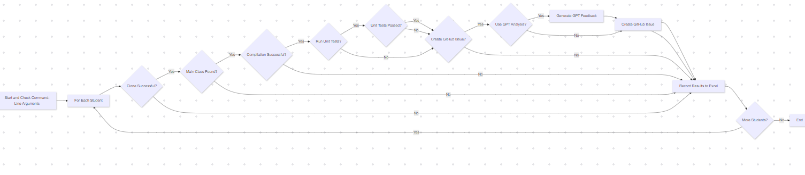
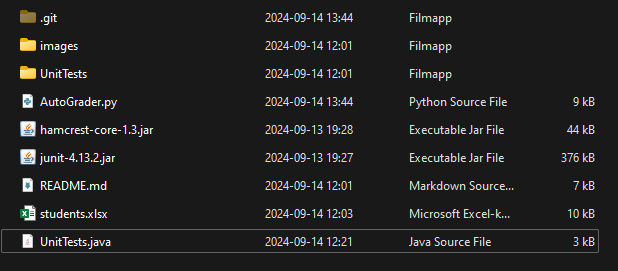
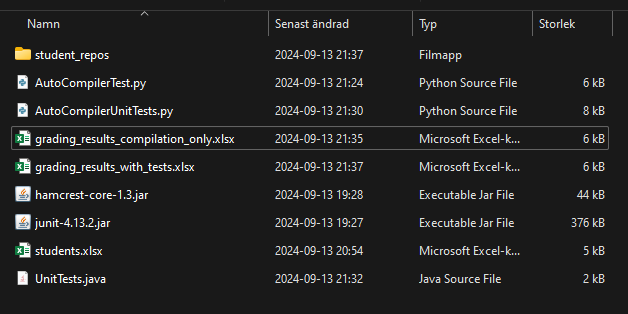
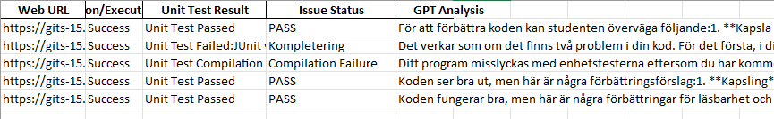
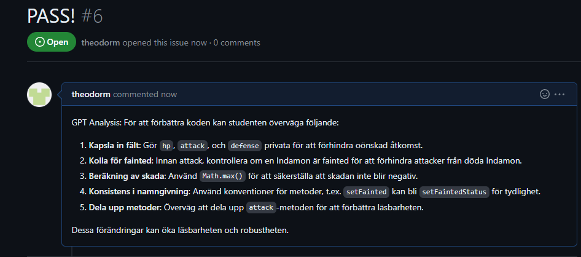
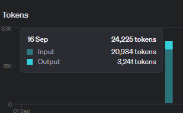
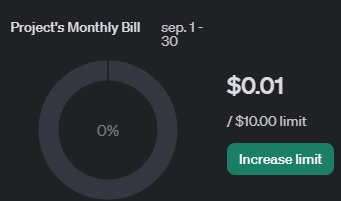

# For other people using the tool
Please contribute to it. My plans:
Make the tests more robust.
Fix the structure of the code (took a hit in readability after the PALINDA modification).
Add an intermediary step between posting the result as an issue where the TA then reads through the code + potentially knows external reasons and changes the tests verdict.

# Automatic Grader

## Overview
This repository contains Python scripts for automating the process of cloning, compiling, and running unit tests on student repositories for both Java and Go programming languages. It works with repositories hosted on `gits-15.sys.kth.se` and reads student IDs from an Excel file. For Java tasks (Task-1 to Task-19), it follows the traditional naming scheme, while for Go tasks (Task-20 and above), it uses the palinda naming convention. Optionally, it can automatically create GitHub issues based on the results of the compilation and testing. Additionally, the script can provide detailed feedback using GPT analysis.

### Language and Task Mapping
- **Java Tasks (1-18)**: Repository suffix follows `task-{number}` format
- **Java Task 19**: Special case using `quicksort` suffix 
- **Go Tasks (20+)**: Repository suffix follows `palinda-{n}` format where n = task_number - 19
  - Example: Task-20 → palinda-1, Task-21 → palinda-2, etc.



## Directory Before and After Script Execution

### Before Running the Script:
Here is how the directory structure looks before cloning the repositories:



### After Running the Script:
After running the script, the cloned repositories and compiled classes appear as follows:



## Output Files

### Output from Running Unit Tests:
The final grading results will look like this in the generated Excel file when both compilation and unit tests are run, if all run arguments are Y:



## New Features and Updates
The script has been enhanced to support additional features:
1. **Optional Unit Tests**: You can now choose whether or not to run unit tests.
2. **Automatic GitHub Issue Creation**: If a GitHub token is provided, the script will automatically create GitHub issues based on the compilation and test results.
3. **Main Class Detection**: The script automatically detects the main Java class in the student's code.
4. **Timeout for Compilation**: A timeout mechanism is in place to prevent processes from running indefinitely.
5. **GPT Analysis**: The script can generate feedback using GPT based on the student's code and the test results, offering constructive feedback.
6. **Go Language Support**: Added support for Go programming assignments (Task-20 and above) with automatic test execution using `go test`.
7. **Non-Participating Students**: Students can opt out of having their code sent to GPT analysis while still receiving grading feedback.
8. **Repository Activity Check**: Automatically fails submissions with no commits in the last 100 days to ensure current work.
9. **UV Dependency Management**: The project now uses `uv` for fast and reliable Python dependency management.
10. **Dual Environment File Support**: Supports both `.env` and `API_TOKENS.env` for backwards compatibility.

## Interpreting the Output

When running the script (`AutoGrader.py`), you will get detailed output about the results of compiling and running the student's code. Here’s how to interpret the different messages you might encounter:

### 1. **Unit Test Passed**
   - **Meaning**: The student's code compiled successfully, and all unit tests executed and passed without any errors.
   - **Action**: This indicates the code works as expected, and the logic meets the requirements of the assignment.

### 2. **Unit Test Failed**
   - **Meaning**: The student's code compiled successfully, but one or more tests failed.
   - **Details**: This means the student's code may have logical errors or incorrect behavior. Review the failure messages for more details.
   - **Example**:
     ```text
     Unit Test Failed:
     JUnit version 4.13.2
     ..E..
     There were 2 failures:
     1) testSettersAndGetters(UnitTests)
        java.lang.AssertionError
        at org.junit.Assert.fail(Assert.java:87)
        at UnitTests.testSettersAndGetters(UnitTests.java:40)
     ```
   - **Action**: Identify issues such as incorrect return values or logic.

### 3. **Unit Test Compilation Failed**
   - **Meaning**: The student's code compiled successfully, but the unit test file (`UnitTests.java`) failed to compile.
   - **Details**: This happens when the student's code is missing required methods or has incorrect method signatures.
   - **Example**:
     ```text
     Unit Test Compilation Failed:
     C:\path\to\UnitTests.java:47: error: cannot find symbol
     mollyMajOstkrok.attack(arvidKarlSixtenSiberov);
                      ^
     symbol: method attack(Indamon)
     location: variable mollyMajOstkrok of type Indamon
     ```
   - **Action**: Review missing methods or incorrect signatures in the student's code.

### 4. **Main Class Not Found**
   - **Meaning**: The script could not detect the `main` class in the student's code.
   - **Action**: Ensure the `main` method exists and is properly formatted.

### 5. **Compilation Failed**
   - **Meaning**: The student's Java files failed to compile.
   - **Action**: Review the error messages to identify syntax or structural issues in the code.

### Summary:
- **Unit Test Passed**: The code compiled and passed all tests.
- **Unit Test Failed**: The code compiled, but the tests failed due to logical or functional errors.
- **Unit Test Compilation Failed**: The student's code compiled, but the unit tests failed to compile.
- **Main Class Not Found**: The script couldn’t find the `main` class.
- **Compilation Failed**: The code did not compile successfully.

## GitHub Issue Creation

### Prerequisites

#### GitHub Personal Access Token (Optional for Issue Creation):

If you wish to enable automatic issue creation, you need to generate a GitHub Personal Access Token (PAT). If you want to extend the capability of the compile and unit tests, also place a GPT API token in the `API_TOKENS.env` file.

#### Generate a Token:

1. Go to [https://gits-15.sys.kth.se/settings/tokens](https://gits-15.sys.kth.se/settings/tokens).
2. Generate a new token with the necessary permissions (e.g., `repo` scope).

### Set Up the `API_TOKENS.env` File:

1. Copy the example file:

    ```bash
    cp API_TOKENS.env.example API_TOKENS.env
    ```

2. Open `API_TOKENS.env` and paste your GitHub PAT and GPT API key (if available) into this file.

### Security Note:
Do not share this file or add it to version control. The `.gitignore` file already includes `API_TOKENS.env` to prevent this.

If enabled, the script can automatically create GitHub issues based on the results:
- **Pass**: A "PASS!" issue is created if all tests pass.
- **Kompletering!**: An issue is created if the unit tests fail, indicating that the student needs to correct their code.

Make sure to store your GitHub token in a `API_TOKENS.env` file for automatic issue creation.

## GPT Feedback and Token Setup

### Prerequisites

#### OpenAI API Key (Required for GPT Feedback):
If you wish to enable GPT-based feedback for student code, you need to obtain an OpenAI API key. This will allow the script to generate constructive feedback automatically based on the compilation and unit test results.

#### Generate an OpenAI API Key:
1. Go to the [OpenAI API page](https://platform.openai.com/account/api-keys).
2. Create a new API key.
3. Copy the API key for use in the next step.

#### Set Up the `API_TOKENS.env` File:
To enable GPT feedback and GitHub issue creation, you need to store both the GitHub Personal Access Token (PAT) and the OpenAI API key in the `API_TOKENS.env` file.

1. Copy the example file:

    ```bash
    cp API_TOKENS.env.example API_TOKENS.env
    ```

2. Open the `API_TOKENS.env` file and paste both your GitHub PAT and the OpenAI API key as follows:
    ```bash
    GITHUB_TOKEN=your_github_token_here
    OPENAI_API_KEY=your_openai_api_key_here
    ```

### Security Note:
Do not share this file or add it to version control. The `.gitignore` file already includes `API_TOKENS.env` to prevent this.

### GPT Feedback Process

Once the OpenAI API key is configured, the script can automatically generate feedback for student assignments. Based on the success or failure of compilation and unit tests, GPT will analyze the student’s code and provide constructive suggestions.

#### Feedback Types:
1. **Pass**: When all tests pass, GPT will give feedback on how the student can further improve their code, such as suggestions for better code structure, readability, or optimization.
2. **Test Failure**: If unit tests fail, GPT will help diagnose potential issues, offering hints and recommendations without solving the problem for the student.
3. **Compilation Failure**: In the case of a compilation error, GPT will provide suggestions to help the student debug their code and identify the error source.

#### Example of GPT-Generated Feedback:
The feedback generated by GPT is displayed in the form of a GitHub issue (if enabled) or saved to an Excel file for review.

Here’s an example of what a GPT-generated issue looks like:

- 

### Cost of Running GPT Feedback

Running GPT feedback for all 16 students on one task costs approximately $0.01, making it a cost-effective way to provide personalized feedback at scale.

- 
- 

### Enabling GPT in the Script

To enable GPT feedback when running the script, use the following command:

```bash
python AutoGrader.py <task_number> [Y/N] [Y/N] [Y/N]
```

## Files
- `AutoGrader.py`: Script for cloning, compiling, running unit tests, and creating GitHub issues for both Java and Go.
- `students.xlsx`: Template for inputting student IDs (empty for privacy reasons).
- `non_participating.xlsx`: Optional file for students who opt out of GPT analysis.
- `UnitTests/`: Directory containing unit test files organized by task number.
  - For Java: `.java` test files
  - For Go: `_test.go` test files

## Prerequisites
Make sure you have the following installed:
- Python 3.8+
- UV for dependency management: `curl -LsSf https://astral.sh/uv/install.sh | sh`
- JUnit (Download: [JUnit 4.13.2](https://search.maven.org/artifact/junit/junit/4.13.2/jar))
- Hamcrest (Download: [Hamcrest 1.3](https://search.maven.org/artifact/org.hamcrest/hamcrest-core/1.3/jar))

### **Important**: Place the JAR files (`junit-4.13.2.jar` and `hamcrest-core-1.3.jar`) in the same directory as the Python scripts for the compilation and unit testing to work.

### Dependencies Installation
Install Python dependencies using UV:
```bash
uv sync
```

## Non-Participating Students Feature

### Overview
Some students may choose not to have their code sent to GPT analysis for privacy reasons. The script supports this through a `non_participating.xlsx` file.

### Setup
1. Create a `non_participating.xlsx` file in the same directory as the script
2. List student IDs in column A (same format as `students.xlsx`)
3. Students listed in this file will:
   - Still receive normal compilation and unit test feedback
   - Get stack traces instead of GPT analysis in their issues
   - Have their code **not sent** to OpenAI's API

### Privacy Protection
The script automatically detects non-participating students and ensures their code is never transmitted to external APIs while maintaining full grading functionality.

## How to Use

1. **Prepare the Excel File**: The `students.xlsx` file should have student IDs in the first column.
2. **Set Up the Unit Test**: Place the `UnitTests.java` file in the same directory as the scripts.
3. **Ensure the JAR Files Are in Place**: The `junit-4.13.2.jar` and `hamcrest-core-1.3.jar` must be in the same directory as the Python scripts.
4. **Run the Script**:
   - For unit testing: `python AutoGrader.py <task_number> [Y/N] [Y/N] [Y/N]`
     - First Y/N: Run unit tests? Default is Y.
     - Second Y/N: Create GitHub issues? Default is N.
     - Third Y/N: Use GPT? Default is N.
   - For compile-only: `python AutoGrader.py <task_number> N`

   **Examples**:
   - `python AutoGrader.py 2`
   - `python AutoGrader.py 2 Y Y`
   - `python AutoGrader.py 2 Y Y Y`

5. **View the Results**: The script generates an Excel file (`grading_results.xlsx`) with the compilation and unit test results.

## Notes on Unit Tests
This script relies on good unit tests. Ensure that `UnitTests.java` is up-to-date and aligns with the specific assignment requirements. Keep the tests relevant and clear, and adapt as needed based on the learning objectives for each week.

## GitHub
Created by Theodor Malmgren. [GitHub: T-Mose](https://github.com/T-Mose/AutomatedGrading)

