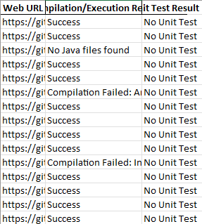

# Auto Compiler & Unit Tester

## Overview
This repository contains Python scripts for automating the process of cloning, compiling, and running unit tests on student Java repositories. It works with repositories hosted on `gits-15.sys.kth.se` and reads student IDs from an Excel file.

## Directory Before and After Script Execution

### Before Running the Script:
Here is how the directory structure looks before cloning the repositories:


### After Running the Script:
After running the script, the cloned repositories and compiled classes appear as follows:


## Output Files

### Output from Running Unit Tests:
The final grading results will look like this in the generated Excel file when both compilation and unit tests are run:


### Output from Running Only Compilation Tests:
If you run only the compilation tests (without unit tests), the results will look like this:



## Interpreting the Output

When running the script (`AutoCompilerUnitTest.py)`), you will get detailed output about the results of compiling and running the student's code. Here’s how to interpret the different messages you might encounter:

### 1. **Unit Test Passed**
   - **Meaning**: The student's code compiled successfully, and all unit tests executed and passed without any errors.
   - **Action**: This indicates the code works as expected, and the logic meets the requirements of the assignment.

### 2. **Unit Test Failed**
   - **Meaning**: The student's code compiled successfully, and the unit tests were executed, but one or more tests failed.
   - **Details**: This means the student's code may have logical errors or incorrect behavior. The failure messages in the output provide more details, including what was expected and what was actually produced.
   - **Example**:
     ```text
     Unit Test Failed:
     JUnit version 4.13.2
     ..E..
     There were 2 failures:
     1) testSettersAndGetters(UnitTests)
        java.lang.AssertionError
        at org.junit.Assert.fail(Assert.java:87)
        at UnitTests.testSettersAndGetters(UnitTests.java:40)
     ```

   - **Action**: Review the failure messages to identify the exact issues (e.g., incorrect return values, incorrect logic, or missing features).

### 3. **Unit Test Compilation Failed**
   - **Meaning**: The student's code compiled successfully, but the unit test file (`UnitTests.java`) failed to compile.
   - **Details**: This typically occurs when the student's code is missing required methods or has incorrect method signatures (e.g., missing or mismatched arguments). The test cannot be run because it references parts of the student's code that don't exist or are inaccessible.
   - **Example**:
     ```text
     Unit Test Compilation Failed:
     C:\path\to\UnitTests.java:47: error: cannot find symbol
     mollyMajOstkrok.attack(arvidKarlSixtenSiberov);
                      ^
     symbol: method attack(Indamon)
     location: variable mollyMajOstkrok of type Indamon
     ```
   - **Action**: Investigate the compilation failure details to determine what is missing or incorrect in the student's code (e.g., a missing method or a private method that should be public).

### Summary:
- **Unit Test Passed**: The code compiled and passed all tests.
- **Unit Test Failed**: The code compiled, but the tests failed due to logical or functional errors.
- **Unit Test Compilation Failed**: The student's code compiled, but the unit tests failed to compile due to missing methods, incorrect signatures, or access issues.

## Importance of Good Unit Tests

This script is only as effective as the quality of the unit tests provided. The `UnitTests.java` file must accurately test the core functionality required by the assignment. Careful attention should be paid to ensuring the tests cover all edge cases and typical use cases.

I will aim to maintain up-to-date unit tests for each weekly assignment in the UnitTests.java file, located in the UnitTests folder of this repository. However, it is important to review and adapt the tests as needed for each specific assignment, as there will always be certain conditions where you may choose to be more lenient or stricter. For example, in Task 2, I modified the tests to add a constructor argument for isFainted since all of my students made this 'mistake,' and I did not find the instructions clearly prohibiting this action.

If the unit tests are incomplete or poorly designed, they might not catch all errors or might provide misleading results. Therefore, it is essential to keep the tests relevant and aligned with the learning objectives for each assignment.

## Files
- `AutoCompilerUnitTest.py`: Script for cloning, compiling, and running unit tests.
- `AutoCompilerTest.py`: Script for cloning and compiling Java code (without running unit tests).
- `students.xlsx`: Template for inputting student IDs (empty for privacy reasons).
- `UnitTests.java`: Placeholder unit test file to be replaced for each assignment.

## Prerequisites
Make sure you have the following installed:
- Python 3.x
- GitPython: `pip install gitpython`
- Pandas: `pip install pandas`
- JUnit (Download: [JUnit 4.13.2](https://search.maven.org/artifact/junit/junit/4.13.2/jar))
- Hamcrest (Download: [Hamcrest 1.3](https://search.maven.org/artifact/org.hamcrest/hamcrest-core/1.3/jar))

### **Important**: Place the JAR files (`junit-4.13.2.jar` and `hamcrest-core-1.3.jar`) in the same directory as the Python scripts for the compilation and unit testing to work.

## How to Use
1. **Prepare the Excel File**: The `students.xlsx` file should have student IDs in the first column.
2. **Set Up the Unit Test**: Place the `UnitTests.java` file in the same directory as the scripts.
3. **Ensure the JAR Files Are in Place**: The `junit-4.13.2.jar` and `hamcrest-core-1.3.jar` must be in the same directory as the Python scripts.
4. **Add Unit tests**: Either from the folder or selfmade ones, into the UnitTests.java file. By default is this emtpy. If selfmade ones are made, paste these in into this files class.
5. **Run the Script**: 
   - For unit testing: `python AutoGrader.py <task_number>`
   - For compile-only: `python AutoGrader.py <task_number> N` 

   Replace `<task_number>` with the appropriate task (e.g., 2 for Task 2).
   The second parameter is optional
      `<Y>` or nothing (default) to run with unit tests
      `<N>` to only compile the students reposetories
   
   **Examples**: 
      python AutoCompilerUnitTest.py 2 
      python AutoCompilerUnitTest.py 2 N
