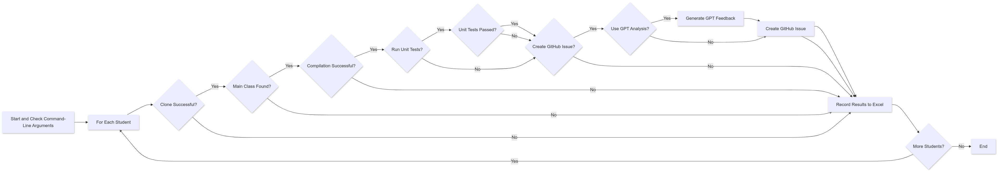
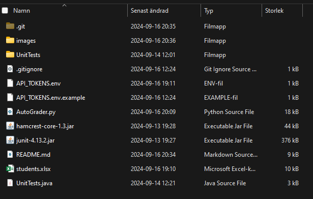
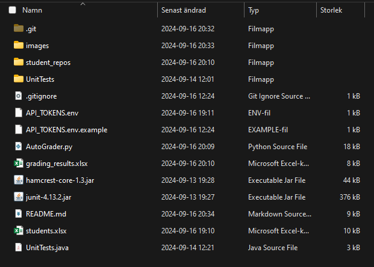

# Auto Compiler & Unit Tester

## Overview
This repository contains Python scripts for automating the process of cloning, compiling, and running unit tests on student Java repositories. It works with repositories hosted on `gits-15.sys.kth.se` and reads student IDs from an Excel file. Optionally, it can automatically create GitHub issues based on the results of the compilation and testing.




## Directory Before and After Script Execution

### Before Running the Script:
Here is how the directory structure looks before cloning the repositories:



### After Running the Script:
After running the script, the cloned repositories and compiled classes appear as follows:



## Output Files

### Output from Running Unit Tests:
The final grading results will look like this in the generated Excel file when both compilation and unit tests are run:


### Output from Running Only Compilation Tests:
If you run only the compilation tests (without unit tests), the results will look like this:


## New Features and Updates
The script has been enhanced to support additional features:
1. **Optional Unit Tests**: You can now choose whether or not to run unit tests.
2. **Automatic GitHub Issue Creation**: If a GitHub token is provided, the script will automatically create GitHub issues based on the compilation and test results.
3. **Main Class Detection**: The script automatically detects the main Java class in the student's code.
4. **Timeout for Compilation**: A timeout mechanism is in place to prevent processes from running indefinitely.

## Interpreting the Output

When running the script (`AutoGrader.py`), you will get detailed output about the results of compiling and running the student's code. Here’s how to interpret the different messages you might encounter:

### 1. **Unit Test Passed**
   - **Meaning**: The student's code compiled successfully, and all unit tests executed and passed without any errors.
   - **Action**: This indicates the code works as expected, and the logic meets the requirements of the assignment.

### 2. **Unit Test Failed**
   - **Meaning**: The student's code compiled successfully, but one or more tests failed.
   - **Details**: This means the student's code may have logical errors or incorrect behavior. Review the failure messages for more details.
   - **Example**:
     ```text
     Unit Test Failed:
     JUnit version 4.13.2
     ..E..
     There were 2 failures:
     1) testSettersAndGetters(UnitTests)
        java.lang.AssertionError
        at org.junit.Assert.fail(Assert.java:87)
        at UnitTests.testSettersAndGetters(UnitTests.java:40)
     ```

   - **Action**: Identify issues such as incorrect return values or logic.

### 3. **Unit Test Compilation Failed**
   - **Meaning**: The student's code compiled successfully, but the unit test file (`UnitTests.java`) failed to compile.
   - **Details**: This happens when the student's code is missing required methods or has incorrect method signatures.
   - **Example**:
     ```text
     Unit Test Compilation Failed:
     C:\path\to\UnitTests.java:47: error: cannot find symbol
     mollyMajOstkrok.attack(arvidKarlSixtenSiberov);
                      ^
     symbol: method attack(Indamon)
     location: variable mollyMajOstkrok of type Indamon
     ```
   - **Action**: Review missing methods or incorrect signatures in the student's code.

### 4. **Main Class Not Found**
   - **Meaning**: The script could not detect the `main` class in the student's code.
   - **Action**: Ensure the `main` method exists and is properly formatted.

### 5. **Compilation Failed**
   - **Meaning**: The student's Java files failed to compile.
   - **Action**: Review the error messages to identify syntax or structural issues in the code.

### Summary:
- **Unit Test Passed**: The code compiled and passed all tests.
- **Unit Test Failed**: The code compiled, but the tests failed due to logical or functional errors.
- **Unit Test Compilation Failed**: The student's code compiled, but the unit tests failed to compile.
- **Main Class Not Found**: The script couldn’t find the `main` class.
- **Compilation Failed**: The code did not compile successfully.

## GitHub Issue Creation

# Prerequisites

### GitHub Personal Access Token (Optional for Issue Creation):

If you wish to enable automatic issue creation, you need to generate a GitHub Personal Access Token (PAT). If you want to extend the capability of the compile and unit tests, also place a GPT api token in the `API_TOKENS.env` file.

### Generate a Token:

1. Go to [https://gits-15.sys.kth.se/settings/tokens](https://gits-15.sys.kth.se/settings/tokens).
2. Generate a new token with the necessary permissions (e.g., `repo` scope).

### Set Up the `API_TOKENS.env` File:

1. Copy the example file:

    ```bash
    cp API_TOKENS.env.example API_TOKENS.env
    ```

2. Open `API_TOKENS.env` and paste your GitHub PAT into this file.

### Security Note:
Do not share this file or add it to version control. The `.gitignore` file already includes `API_TOKENS.env` to prevent this.


If enabled, the script can automatically create GitHub issues based on the results:
- **Pass**: A "PASS!" issue is created if all tests pass.
- **Kompletering!**: An issue is created if the unit tests fail, indicating that the student needs to correct their code.

Make sure to store your GitHub token in a `API_TOKENS.env` file for automatic issue creation.

## Files
- `AutoGrader.py`: Script for cloning, compiling, running unit tests, and creating GitHub issues.
- `students.xlsx`: Template for inputting student IDs (empty for privacy reasons).
- `UnitTests.java`: Placeholder unit test file to be replaced for each assignment.

## Prerequisites
Make sure you have the following installed:
- Python 3.x
- GitPython: `pip install gitpython`
- Pandas: `pip install pandas`
- PyGithub: `pip install PyGithub`
- openai: `pip install openai`
- JUnit (Download: [JUnit 4.13.2](https://search.maven.org/artifact/junit/junit/4.13.2/jar))
- Hamcrest (Download: [Hamcrest 1.3](https://search.maven.org/artifact/org.hamcrest/hamcrest-core/1.3/jar))

### **Important**: Place the JAR files (`junit-4.13.2.jar` and `hamcrest-core-1.3.jar`) in the same directory as the Python scripts for the compilation and unit testing to work.

## How to Use

1. **Prepare the Excel File**: The `students.xlsx` file should have student IDs in the first column.
2. **Set Up the Unit Test**: Place the `UnitTests.java` file in the same directory as the scripts.
3. **Ensure the JAR Files Are in Place**: The `junit-4.13.2.jar` and `hamcrest-core-1.3.jar` must be in the same directory as the Python scripts.
4. **Run the Script**:
   - For unit testing: `python AutoGrader.py <task_number> [Y/N] [Y/N] [Y/N]`
     - First Y/N: Run unit tests? Default is Y.
     - Second Y/N: Create GitHub issues? Default is N.
     - Third Y/N: Use GPT? Default is N.
   - For compile-only: `python AutoGrader.py <task_number> N`

   **Examples**:
   - `python AutoGrader.py 2`
   - `python AutoGrader.py 2 Y Y`
   - `python AutoGrader.py 2 Y Y Y`

5. **View the Results**: The script generates an Excel file (`grading_results.xlsx`) with the compilation and unit test results.

## Notes on Unit Tests
This script relies on good unit tests. Ensure that `UnitTests.java` is up-to-date and aligns with the specific assignment requirements. Keep the tests relevant and clear, and adapt as needed based on the learning objectives for each week.

## GitHub
Created by Theodor Malmgren. [GitHub: T-Mose](https://github.com/T-Mose/AutomatedGrading)
